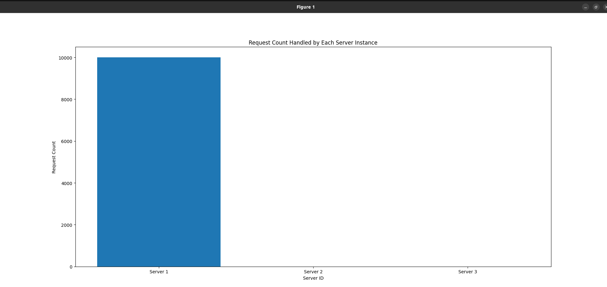

# Load Balancer Analysis 

---

## Members
     
  - 144915 Jerome Mahia
  - 145351 Kihanya Mungai
  - 145835 Humphrey James
  - 145182 Emmanuel Omondi

## Introduction

In this project, we conduct an analysis of a load balancer implemented using consistent hashing. 
---

## Assumptions and Design Choices

### Assumptions
1. **Uniform Distribution**: We assume that incoming requests are uniformly distributed across the request space.
2. **Fault Tolerance**: We assume that the load balancer can handle server failures and spawn new instances as needed.
3. **Scalability**: We assume that the load balancer can scale effectively with an increase in the number of server containers.
4. **Hash Function**: We assume that the hash function used for request mapping produces evenly distributed hash values.

### Design Choices
1. **Consistent Hashing**: We chose consistent hashing for load balancing due to its ability to minimize disruption when servers are added or removed.
2. **Virtual Server Mapping**: We implemented virtual server mapping to improve load distribution by introducing multiple virtual servers per physical server.
3. **Experimentation Approach**: We opted for a systematic experimentation approach, varying parameters such as the number of server containers to analyze their impact on load balancing performance.

---

## Installation

### Prerequisites

- Python 3.x
- Flask
- Requests library (for testing purposes)

### Installation Steps

1. Clone the repository:

    ```bash
    git clone https://github.com/Jerome-Mahia/Distributed-Systems-Load-Balancer.git
    

2. Create a virtual environment and activate it:

    ```bash
    python3 -m venv venv
    source venv/bin/activate
    ```

3. Install the required dependencies:

    ```bash
    pip install Flask requests
    ```

---

## Usage

### Running the Server

Start the Flask server:

```bash
python server.py
```

## Tasks

 **1: Distribution of Requests**
   - Ability to send requests to /home and /heartbeat and receive Json response
   - 
   - 

**2: Hash Function**
   - This block of code defines the hash functions and implements the Consistent Hashing class, which is responsible for mapping requests to server containers based on their hash values and maintaining the virtual server mappings to ensure balanced load distribution.
    ### Consistent Hashing Load Balancer Algorithm

#### Inputs:
- `NUM_SLOTS`: Total number of slots.
- `K`: Number of virtual servers per container.
- `server_replicas`: List of initial servers.

#### Hash Functions:

1. **Request Hashing**
   - **Function**: `hash_request(request_path)`
   - **Description**: Computes `hash(request_path) % (NUM_SLOTS * 2)`.

2. **Virtual Server Hashing**
   - **Function**: `hash_virtual_server(server_id, j)`
   - **Description**: Computes `(hash(server_id) + j + 2 * j + 25) % (NUM_SLOTS * 2)`.

#### Class: `ConsistentHashing`

1. **Initialization**
   - Initializes `servers` list.

2. **Add Server**
   - **Method**: `add_server(server_id)`
   - Adds `K` virtual servers using `hash_virtual_server`.

3. **Get Server**
   - **Method**: `get_server(request_path)`
   - Maps request to closest server using `hash_request`.

#### Steps:

1. Initialize `consistent_hashing`.
2. Add servers from `server_replicas` using `consistent_hashing.add_server(server_id)`. 

**3: Load Balancer Scalability**
   - **Server replicas**: request the replica endpoint to view number of replica servers.
   - **Observations**:
   - 
   
   - **Add new server instance**: Endpoint /add will add new server instances in the load balancer
   - 
   - **Delete**
   - 
   - **Test endpoint**
   - 
   - 
 


 **4: Analysis**
   - **Description**: Test the load balancer's scalability by varying the number of server containers.
   - 
   - 
   - **Observations**: The server load is more likely to distributed when there are a greater number of server containers.
   - N=2-6
   - 
   - 
   - **Response to server failure**: In case of server failure, a new instance should be created to handle the load. 
   - Trigger failure using the server failure endpoint
   - 
   - 
    
    
---


